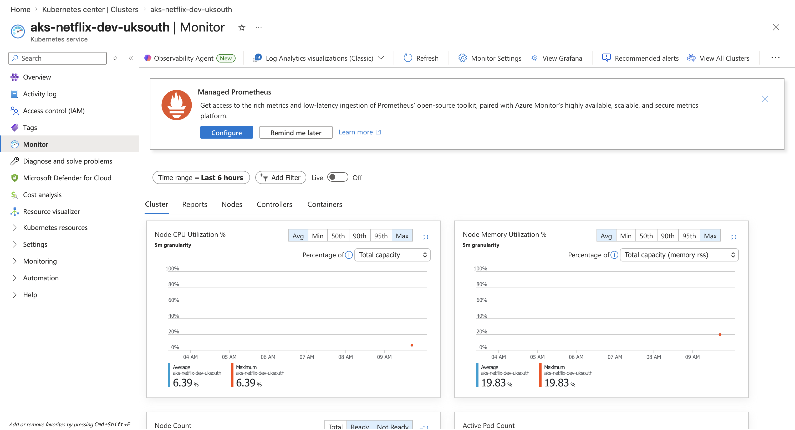
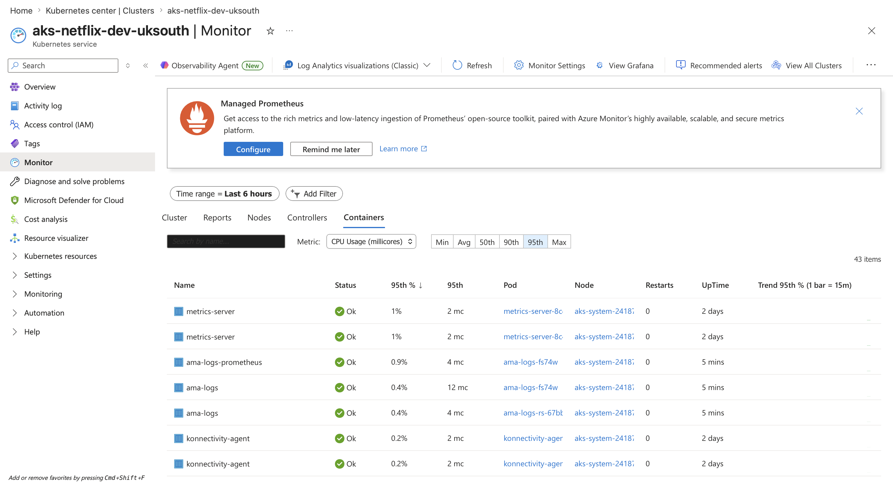
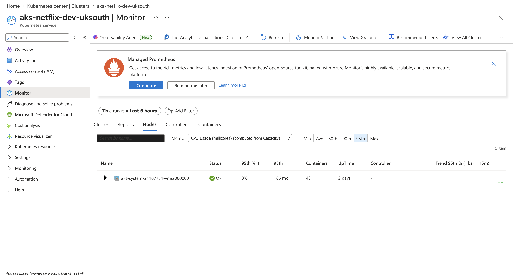

# Netflix DevSecOps Platform on Azure

## Project Purpose

This project takes an existing Netflix-style video streaming application and builds a secure, production-grade DevSecOps deployment platform around it on Microsoft Azure.

The application itself already exists. The main engineering work is to securely containerise, deploy, scan, monitor and release the application using cloud-native DevSecOps practices.

## Business Problem

The business has an existing video streaming application that needs to be deployed safely to the cloud.

The platform must allow users to access the app through a proper domain while protecting customer data, preventing insecure releases, separating development from production, and allowing safe rollback if a deployment fails.

## Engineering Goal

Build separate development and production environments using Azure, Terraform, Kubernetes, GitHub Actions and security tooling.

## Environments

- Development: lower-cost environment for testing and validating changes.
- Production: hardened environment with stronger networking, WAF, private endpoints, approval gates and rollback.

## Main Tools

- Azure Kubernetes Service
- Azure Container Registry
- Azure Key Vault
- Azure Front Door
- Azure WAF
- Terraform
- Kubernetes YAML
- GitHub Actions
- SonarCloud
- Trivy
- Checkov
- OWASP ZAP
- Argo Rollouts
- Prometheus
- Grafana

## Evidence Screenshots

### AKS Monitoring — Cluster Overview

### AKS Monitoring — Container Health

### AKS Monitoring — Node Health

### Deployed Netflix Frontend — Homepage

### Deployed Netflix Frontend — Movie Categories

